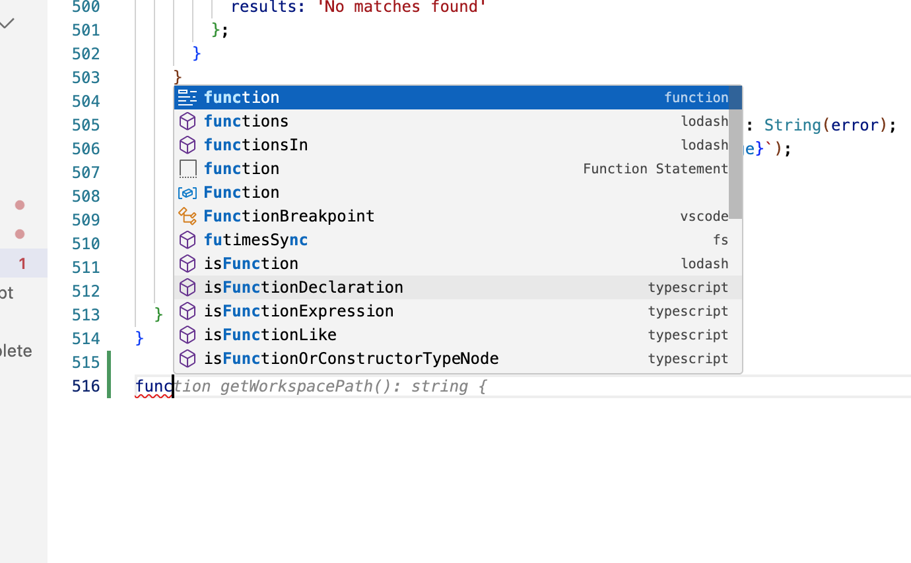
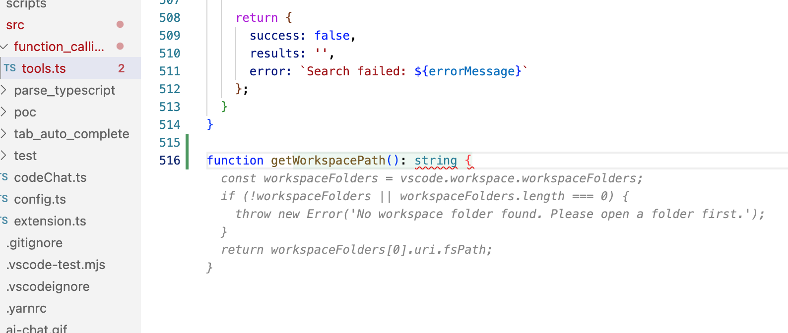
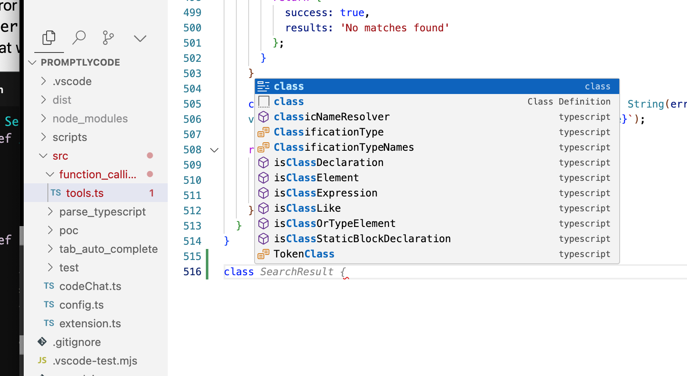
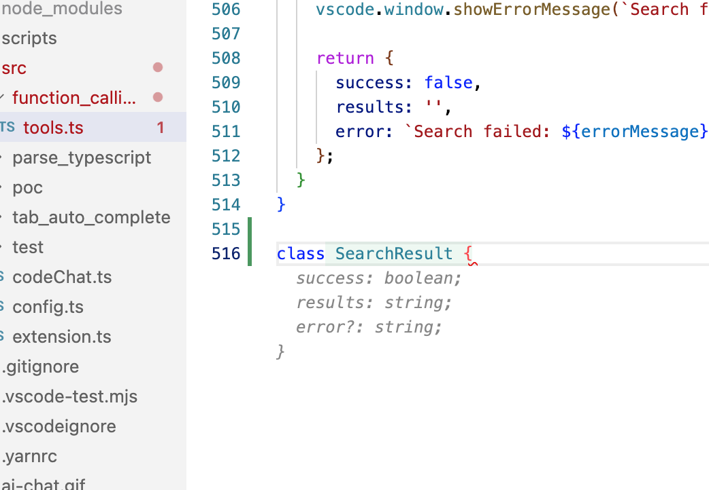

# PromptlyCode inline completion model
* PromptlyCode inline completion model by PyTorch

## Features

- [ ]  Tab automatically complete code and predict code use vscode inline completion

## Init

* Setup python env
```sh
conda create -n inline-completion-model python=3.11
conda activate  inline-completion-model
poetry install
```

## Seq2Seq model

* Input, Output Prediction

```
Input: "def func(x):"
Output Prediction: "return x * x"

Input: "for i in range(n):"
Target: "sum += i"

(['def func(x):', 'x = x + 1', 'return x'],
['x = x + 1', 'return x', 'print(func(5))'])
```

* Process Flowchart

```txt
Parse Python Files ─> Build Dataset ─> Train Model ─> Test Model
       │                     │                │               │
   File Parsing        Vocabulary      Training Loop       Predict
       │               Creation            ↓                  ↓
     Input/Target Pairs ─> DataLoader ─> Loss Optimization ─> Generate Output

```

## Achieve the target effect




